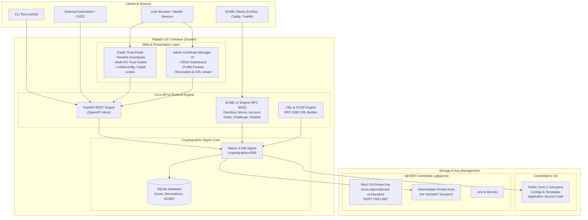

# 🔒 Rajlabs-CA

[](LICENSE)
[](docker-compose.yml)
[](https://python.org)
[](https://datatracker.ietf.org/doc/html/rfc8555)
[](https://datatracker.ietf.org/doc/html/rfc5280)
[](SECURITY.md)

**Rajlabs-CA** is an enterprise-grade, modern, containerized Private Certificate Authority (PKI) and Trust Management Platform. Designed for homelabs, internal enterprise networks, and private clouds, it combines the automated enrollment power of ACME with a full CRUD management dashboard, public device onboarding portal, and strict zero-leak security guarantees.

---

## 🚀 Why Rajlabs-CA is Better than Smallstep CA

| Feature | Smallstep CA (`step-ca`) | **Rajlabs-CA** |
| :--- | :---: | :---: |
| **Public Trust Center** | ❌ None (CLI/MDM only) | ✅ **Built-in responsive web portal with 1-click downloads** |
| **Multi-OS Onboarding Guides** | ❌ Manual documentation | ✅ **Interactive tabbed guides (Win, Mac, iOS, Android, Linux)** |
| **Apple 1-Tap Trust (.mobileconfig)** | ❌ Not generated | ✅ **Auto-generated signed Apple configuration profile** |
| **1-Liner Automated Installers** | ❌ Requires installing `step` binary | ✅ **Native `curl ... \| bash` and `irm ... \| iex` scripts** |
| **Web Certificate Manager (CRUD)** | ❌ No built-in free web UI | ✅ **Full Web Dashboard (Issue, Renew, Revoke, PFX Export)** |
| **ACME v2 Protocol (RFC 8555)** | ✅ Yes | ✅ **Yes (Certbot, Caddy, Traefik, acme.sh)** |
| **Homelab / Private ACME Auto-Validation** | ⚠️ Complex provisioners | ✅ **Seamless intranet validation for `.local` / `.internal`** |
| **RFC 5280 Certificate Revocation Lists (CRL)**| ⚠️ Weak (pushes short certs) | ✅ **Full CRL (.pem/.der) auto-updated upon revocation** |
| **Root CA Private Key Protection** | ⚠️ Stored on host or encrypted | ✅ **Strictly Offline & Zero-Leak (never mounted in Docker)** |
| **Ready-to-Paste Web Server Configs** | ❌ None | ✅ **Auto-generated snippets (Nginx, Caddy, Traefik, Apache)** |
| **Standalone CLI (`certctl`)** | ✅ `step` CLI | ✅ **Lightweight Python/Shell `certctl` CLI** |

---

## 🏛️ Architecture & Security Model



### Zero-Leak Defense Model
1. **Offline Root CA**: The Root CA private key is **NEVER mounted** into the Docker container and is strictly excluded by `.gitignore`.
2. **Intermediate Delegation**: Intermediate CAs (`int-server`, `int-wifi`, `int-iot`) sign routine certificates and CRLs.
3. **Automated Pre-Commit Audit**: Includes `scripts/verify_security.py` to ensure that no private keys, passphrases, or credentials can ever be committed to Git.

---

## ⚡ Quickstart in 30 Seconds

### 1. Clone & Configure
```bash
git clone https://github.com/<your-username>/Rajlabs-CA.git
cd Rajlabs-CA

# Copy environment configuration
cp .env.example .env
```

### 2. Start the Container
```bash
docker compose up -d
```

### 3. Open in Your Browser
* **Public Trust Portal**: [http://localhost:8000/](http://localhost:8000/)
* **Certificate Manager Dashboard**: [http://localhost:8000/dashboard](http://localhost:8000/dashboard)
* **Interactive OpenAPI / Swagger Docs**: [http://localhost:8000/docs](http://localhost:8000/docs)

---

## 📱 Device Trust & Onboarding

### 🪟 Windows (1-Line PowerShell)
Run PowerShell as **Administrator**:
```powershell
irm https://ca.rajlabs.local/install.ps1 | iex
```

### 🐧 Linux (1-Line Shell)
Auto-detects Debian, Ubuntu, RHEL, CentOS, Fedora, Rocky, Arch, and Alpine:
```bash
curl -fsSL https://ca.rajlabs.local/install.sh | sudo bash
```

### 🍎 Apple iOS, iPadOS & macOS
1. Open `https://ca.rajlabs.local/` in **Safari**.
2. Tap **Download Apple Profile (.mobileconfig)** &rarr; tap **Allow**.
3. Go to **Settings** &rarr; **Profile Downloaded** &rarr; tap **Install**.
4. **On iOS/iPadOS**: Go to **Settings** &rarr; **General** &rarr; **About** &rarr; **Certificate Trust Settings** &rarr; toggle **Rajlabs Root CA** to **ON**.

---

## 🔄 ACME v2 Automation

Rajlabs-CA is 100% compatible with standard ACME clients. Point your client to the directory endpoint:

### Certbot
```bash
certbot certonly --standalone \
  --server http://ca.rajlabs.local:8000/acme/directory \
  -d myserver.rajlabs.local
```

### Caddy (`Caddyfile`)
```caddy
myserver.rajlabs.local {
    tls {
        ca http://ca.rajlabs.local:8000/acme/directory
    }
    reverse_proxy localhost:3000
}
```

### Traefik (`traefik.yaml`)
```yaml
certificatesResolvers:
  rajlabsCA:
    acme:
      caServer: http://ca.rajlabs.local:8000/acme/directory
      email: admin@rajlabs.local
      storage: /etc/traefik/acme.json
      httpChallenge:
        entryPoint: web
```

---

## 💻 CLI Tool (`certctl`)

Rajlabs-CA includes a standalone command-line interface:

```bash
# Check PKI health and certificate inventory
python3 cli/certctl.py status

# Install Root CA into current OS trust store
python3 cli/certctl.py root install

# Issue a new certificate with SANs
python3 cli/certctl.py cert create \
  --cn proxmox.rajlabs.local \
  --san proxmox.rajlabs.local,192.168.1.100 \
  --ca int-server \
  --profile server \
  --days 365 \
  --out ./certs/proxmox

# List all issued certificates
python3 cli/certctl.py cert list

# Revoke a certificate and immediately rebuild the CRL
python3 cli/certctl.py cert revoke <serial> --reason keyCompromise

# Renew a certificate
python3 cli/certctl.py cert renew <serial>
```

---

## ⚙️ Configuration Variables

| Variable | Default | Description |
| :--- | :--- | :--- |
| `PORT` | `8000` | Port to bind container web server |
| `BASE_URL` | `http://localhost:8000` | Publicly reachable base URL of the CA server |
| `API_KEY` | `rajlabs_...` | Header token for API management endpoints |
| `ADMIN_PASSWORD` | `rajlabs123` | Password for web dashboard access |
| `CA_ORGANIZATION` | `Rajlabs` | Organization name in certificate Subject DN |
| `ACME_ALLOW_PRIVATE_NETWORKS` | `true` | Auto-validate challenges for internal/homelab domains |
| `ACME_DEFAULT_INTERMEDIATE` | `int-server` | Intermediate CA used for ACME requests |
| `CRL_DAYS_VALID` | `7` | Validity window in days for generated CRLs |
| `AUTO_BOOTSTRAP` | `false` | Automatically initialize Root CA and intermediates if missing |

---

## 🔒 Security Audit Before Git Push

Before pushing your changes to GitHub, run the security audit:
```bash
python3 scripts/verify_security.py
```
This guarantees no private keys or secrets are accidentally committed.

---

## 📄 License

This project is licensed under the **Apache License 2.0** - see the [LICENSE](LICENSE) file for details.
